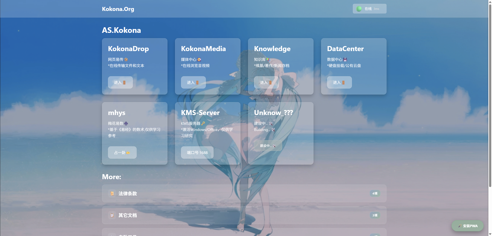

# Kokona 卡片导航模板

纯静态卡片导航页模板，采用玻璃拟态设计，支持 PWA、卡片配置、系统通知、首次访问向导。

所有品牌标识、图标、卡片数据、通知内容都由外部文件驱动，`index.html` 本身不含任何站点专属内容。配合 `build.sh` 交互式脚本完成日常维护。

> **关于代码质量**：本项目为作者设计的自用导航页，代码可能不够优雅，欢迎接手。



---

## 目录结构

```text
/
├── index.html              # 主页面
├── build.sh                # 构建脚本
├── site.config.json        # 站点配置（由 build.sh 生成）
├── manifest.json           # PWA 清单（由 build.sh 生成）
├── sw.js                   # Service Worker（由 build.sh 生成）
├── favicon.png             # 网站图标（建议 512×512）
├── bg.webp                 # 背景图
├── network-test.json       # 状态检测用占位文件
├── first-time.md           # 首次访问条款
├── notice.md               # 系统通知内容
├── cardjson/
│   ├── appcards.json       # 应用卡片数据
│   └── othercards.json     # 折叠面板数据
└── mark/                   # 哈希标记（由 build.sh 生成）
    ├── appcards.mark
    ├── othercards.mark
    └── notice.mark
```

---

## 快速开始

### 1. 克隆仓库

```bash
git clone https://github.com/hsushjk/Kokona-NAV
cd Kokona-NAV
```

### 2. 准备文件

把以下文件放到 Kokona-NAV：

- `favicon.png`（网站图标，最好是 512×512）
- `bg.webp`（背景图，任意尺寸，建议至少 1920×1080，不建议深色背景）
- `first-time.md`（首次访问文档，可以是条款，也可以是欢迎语，Markdown 格式）
- `notice.md`（系统通知，Markdown 格式）
- `cardjson/appcards.json`（卡片数据，根据后面的「配置文件说明」来配置）
- `cardjson/othercards.json`（折叠面板数据，根据后面的「配置文件说明」来配置）

### 3. 运行构建脚本

```bash
chmod +x build.sh
./build.sh
```

脚本会显示菜单：

```text
========================================
        Build-Kokona-NAV
========================================
  1) 修改网页信息
  2) 生成 manifest 和 sw
  3) 更新 card
  4) 更新 notice
  5) 全部执行
  0) 退出
========================================
请选择 [0-5]:
```

### 4. 发布

`build.sh` 可以除外，其它的发布到你惯用的网页服务器上。

---

## 配置文件说明

### `site.config.json`

由 `build.sh` 生成，控制页面上的品牌信息。

```json
{
  "siteName": "主标题",
  "logoText": "左上角文字Logo",
  "title": "浏览器标签标题",
  "copyright": "页脚版权",
  "themeColor": "#3498db",
  "description": "站点描述",
  "lang": "zh-CN"
}
```

| 字段 | 作用 |
|---|---|
| `siteName` | 页面主标题（`<h1>`） |
| `logoText` | 顶部导航左侧 logo 文字 |
| `title` | 浏览器标签页标题 |
| `copyright` | 页脚版权文字 |
| `themeColor` | 浏览器主题色（移动端地址栏颜色） |
| `description` | 站点描述（写入 manifest.json） |

### `cardjson/appcards.json`

应用卡片数据，控制主页面的卡片网格。

```json
{
  "version": "1.0",
  "cards": [
    {
      "id": "card_kokonadrop",
      "title": "KokonaDrop",
      "description": "网页易传📦\n*在线传输文件和文本",
      "links": [
        {
          "text": "进入🚪",
          "template": "https://drop.{host}/"
        }
      ]
    },
    {
      "id": "card_unknown",
      "title": "Unknow_???",
      "description": "建设中...🛠️\nBuilding...🛠️",
      "links": [
        {
          "text": "建设中...🛠️",
          "disabled": true
        }
      ]
    }
  ]
}
```

| 字段 | 说明 |
|---|---|
| `cards[].id` | 卡片 DOM id，可选，用于调试或脚本定位 |
| `cards[].title` | 卡片标题 |
| `cards[].description` | 描述，`\n` 会转换为 `<br>` |
| `cards[].links[].text` | 按钮文字 |
| `cards[].links[].url` | 固定链接 |
| `cards[].links[].template` | 模板链接，`{host}` 会替换为当前访问域名 |
| `cards[].links[].disabled` | 为 `true` 时按钮禁用 |

`template` 与 `url` 二选一，若同时存在，`template` 优先。

### `cardjson/othercards.json`

折叠面板数据，控制页面下方的「More」区块。

```json
{
  "version": "1.0",
  "sections": [
    {
      "id": "legal",
      "title": "条款",
      "icon": "📜",
      "count": "4项",
      "items": [
        {
          "text": "隐私政策",
          "url": "/mdr.html?file=/md/隐私政策.md"
        },
        {
          "text": "用户协议",
          "url": "/mdr.html?file=/md/用户协议.md"
        },
        {
          "text": "免责声明",
          "url": "/mdr.html?file=/md/免责声明.md"
        },
        {
          "text": "合规性说明",
          "url": "/mdr.html?file=/md/合规性说明.md"
        }
      ]
    }
  ]
}
```

| 字段 | 说明 |
|---|---|
| `version` | 保留字段，当前未使用 |
| `sections[].id` | 唯一标识，用作 DOM id，不能重复 |
| `sections[].title` | 折叠面板标题 |
| `sections[].icon` | 图标 emoji，缺省时使用 `📄` |
| `sections[].count` | 右上角小标签，缺省时自动显示 `N项` |
| `sections[].items[].text` | 链接文字 |
| `sections[].items[].url` | 链接地址，建议使用相对路径以兼容子目录部署 |

### `first-time.md`

使用 Markdown 格式。若文件不存在或内容为空，首次访问弹窗不会弹出。

### `notice.md`

系统通知内容，使用 Markdown 格式。修改后需运行 `build.sh` 功能 `4` 重新生成 `mark/notice.mark`，才会推送新通知给用户。

---

## 工作原理

### 配置热更新

页面加载时，`ConfigLoader` 会：

1. 拉取 `cardjson/appcards.json` 和 `cardjson/othercards.json` 的原始字节
2. 计算它们的 SHA-256（与 `sha256sum` 完全一致）
3. 与 `mark/appcards.mark`、`mark/othercards.mark` 里的哈希比对
4. 若不一致，说明服务器上有新版本，重新拉取并刷新页面

`.mark` 文件由 `build.sh` 功能 `3` 生成，必须与对应的 JSON 内容匹配。若 `.mark` 文件缺失，页面会跳过更新检查，不会陷入刷新死循环。

### 系统通知

页面加载 2 秒后，`NoticeManager` 会：

1. 拉取 `mark/notice.mark`
2. 与本地 Cookie `notice_hash` 比对
3. 若不一致，拉取 `notice.md`，用内置 Markdown 解析器渲染并弹出通知
4. 把新的哈希写入 Cookie

修改 `notice.md` 内容并重新生成 `mark/notice.mark`，即可推送新通知。

### PWA 缓存策略

`sw.js` 采用网络优先加缓存回退的混合策略：

- `.mark`、`.md`、`.json` 走网络优先，保证数据最新
- 其他静态资源走缓存优先，加快加载

### 关于 SHA-256

`build.sh` 使用 `sha256sum`（Linux）或 `shasum -a 256`（macOS）计算文件哈希，是对**原始文件字节**做哈希。

`index.html` 使用 `fetch(...).arrayBuffer()` 获取原始字节，再用 `crypto.subtle.digest('SHA-256', buffer)` 计算，**不对内容做任何 trim 或编码转换**。

两者结果完全一致，因此 `.mark` 文件可以直接由 `build.sh` 生成，也可以由你自己的脚本生成。

如果你使用自己的脚本，例如：

```bash
sha256sum cardjson/appcards.json | awk '{print $1}' > mark/appcards.mark
```

同样有效。

---

## 自定义样式

所有样式内联在 `index.html` 的 `<style>` 标签中，通过 CSS 变量控制主题：

```css
:root {
    --border-radius: 12px;                    /* 圆角 */
    --acrylic-bg: rgba(255, 255, 255, 0.2);   /* 玻璃底色 */
    --acrylic-blur: blur(0.5px);              /* 玻璃模糊强度 */
    --status-good: #00FF00;                   /* 在线状态色 */
    --status-error: #e74c3c;                  /* 离线状态色 */
}
```

修改这些变量即可快速调整视觉风格。

---
